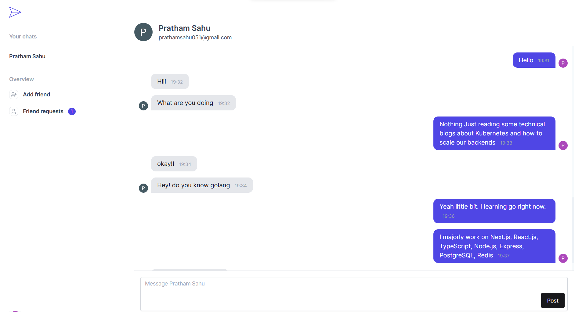
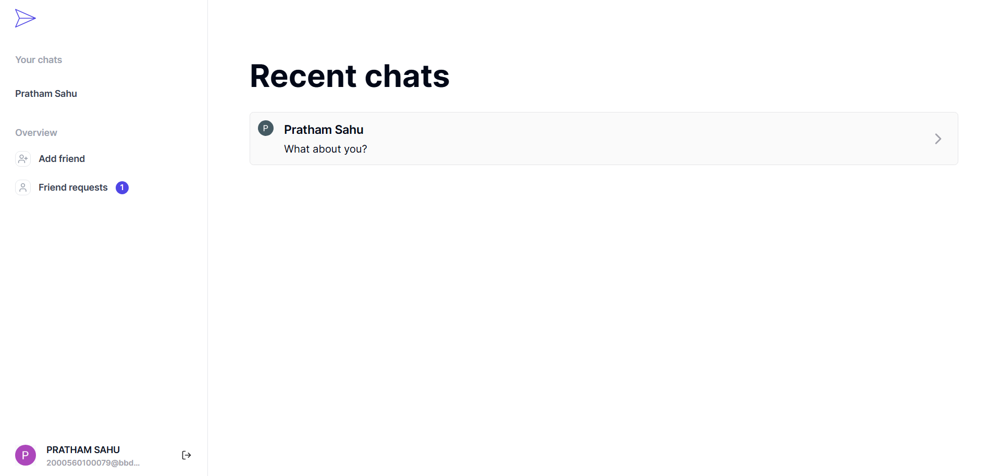

<p align='center'><svg width="150" style="background-color:blue; border-radius: 10px;" viewBox="0 0 2000 2000">
      <path
        fill="currentColor"
        d="m1976.678 964.142-1921.534-852.468c-14.802-6.571-32.107-3.37-43.577 8.046-11.477 11.413-14.763 28.703-8.28 43.532l365.839 836.751-365.839 836.749c-6.483 14.831-3.197 32.119 8.28 43.532 7.508 7.467 17.511 11.417 27.677 11.417 5.37 0 10.785-1.103 15.9-3.371l1921.533-852.466c14.18-6.292 23.322-20.349 23.322-35.861.001-15.514-9.141-29.571-23.321-35.861zm-1861.042-739.791 1664.615 738.489h-1341.737zm321.069 816.954h1334.219l-1655.287 734.35z"
      />
    </svg></p>

---

# 💬 Talkative - Real-time Chatting Application

**Talkative** is a cutting-edge web application designed for seamless, real-time communication. Built with modern technologies like **Next.js**, **React.js**, **WebSockets**, and **Redis**, it offers a secure and smooth chatting experience. Whether it's sending friend requests or engaging in one-on-one conversations, Talkative makes it simple and efficient.

🚀 Explore it live at [Talkative on Vercel](https://talkative-eight.vercel.app/dashboard).


---

## Screenshots

1. Chat Page

<p align='center'></p>

2. Recent Chat Page
<p align='center'></p>

**Want to more about it then visit** - [Talkative](https://talkative-eight.vercel.app/dashboard)

## 🛠 Features

- **Real-time Messaging**: Enjoy instant message delivery for smooth, real-time conversations.
- **Friend Management**: Send and accept friend requests to build a personalized chat network.
- **One-on-One Private Chats**: Converse privately with friends in secure, real-time chat rooms.
- **Google Authentication**: Secure and quick authentication with Google via **NextAuth**.
- **Push Notifications**: Stay updated with push notifications for new messages and friend requests.
- **Optimized Performance**: Built with WebSockets for real-time communication and **Redis** as a database for fast, scalable operations.

---

## 💻 Tech Stack

| Frontend    | Backend      | Authentication | Real-time | Database   | Libraries  |
|-------------|--------------|----------------|-----------|------------|------------|
| Next.js     | Next.js API  | NextAuth       | WebSockets| Redis      | React Query|
| React.js    | TypeScript   | Google Auth   |           |            |            |

Additional Technologies:
- **Redis**: Used as the primary database and for caching sessions and messages.
- **React Query**: Efficient state management for API requests and caching.

---

## 🚀 Getting Started

To set up **Talkative** locally, follow the steps below:

### Prerequisites

- **Node.js** (v14 or later)
- **Redis**: Ensure Redis is installed and running on your machine for real-time data handling.
- **Google OAuth Credentials**: Set up Google OAuth in your Google Developer Console and get your `clientId` and `clientSecret`.

### Installation Steps

1. **Clone the Repository:**

   ```bash
   git clone https://github.com/Prathamm-sahu/talkative.git
   cd talkative
   ```

2. **Install Dependencies:**

   ```bash
   npm install
   ```

3. **Set Up Environment Variables:**

   - Rename `.env.example` to `.env`.
   - Add your Google OAuth credentials and Redis configuration:

     ```
     GOOGLE_CLIENT_ID=<your-client-id>
     GOOGLE_CLIENT_SECRET=<your-client-secret>
     NEXTAUTH_SECRET=<your-next-auth-secret>
     REDIS_URL=<your-redis-url>
     ```

4. **Run the Development Server:**

   ```bash
   npm run dev
   ```

   Now, open [http://localhost:3000](http://localhost:3000) in your browser to explore the app.

---

## 🔧 Project Structure

```
/components     # UI and Reusable components like chat boxes, friend requests, etc.
/app          # Pages for login, signup, and chat interface
src/app/api            # API routes for authentication, friend requests, and messages
/utils          # Helper functions and utilities
/public         # Static assets (icons, images, etc.)
/styles         # Global CSS and styling for the application
```

---

## 🗃 Database

**Talkative** uses **Redis** as the primary database to store session data, manage friend requests, and facilitate real-time message delivery. Redis helps to ensure ultra-low latency and high scalability.

---

## 🌐 Google Auth

Google authentication is powered by **NextAuth**. Users can securely log in using their Google account, which also provides seamless session management and security. To enable Google OAuth in your local environment, you'll need to:

1. Set up a new project in the [Google Developer Console](https://console.cloud.google.com/).
2. Enable the OAuth 2.0 API and create credentials.
3. Add your `clientId` and `clientSecret` to the `.env` file.

---

## 📲 Real-time Chat with WebSockets

For real-time interaction, **Talkative** uses WebSockets, enabling instant message exchange between users. Once connected, users can send and receive messages instantly without reloading the page.

---

## 📄 License

This project is licensed under the [MIT License](https://opensource.org/licenses/MIT).

---

## 🎯 Contributing

We welcome contributions! Feel free to fork the repo and submit pull requests. For major changes, open an issue to discuss improvements or features you'd like to see.
